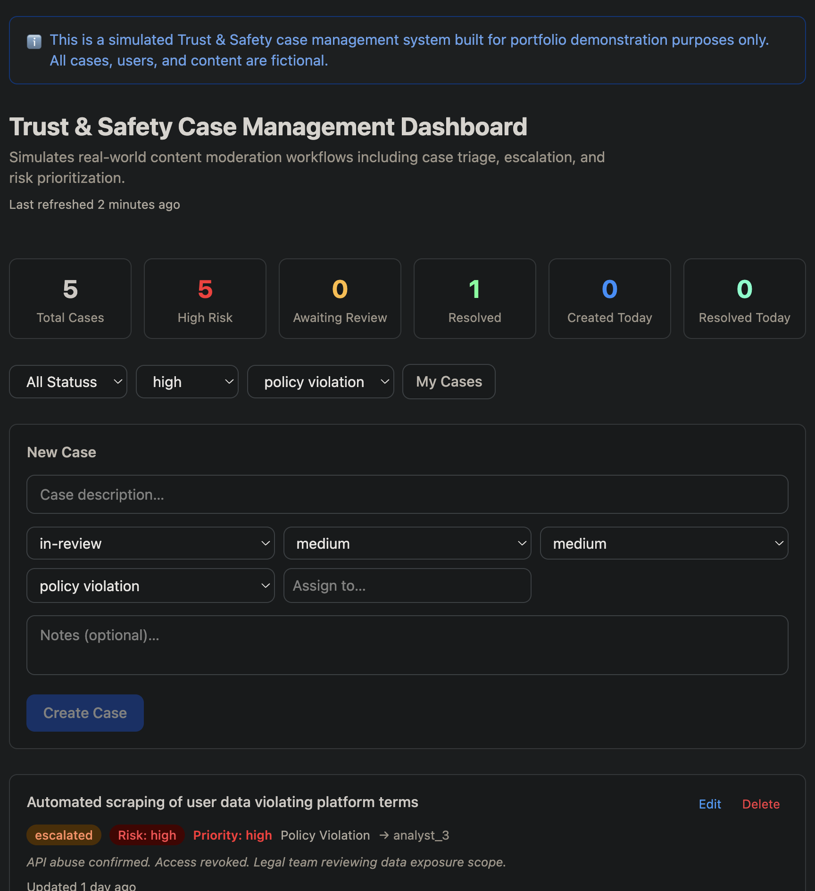
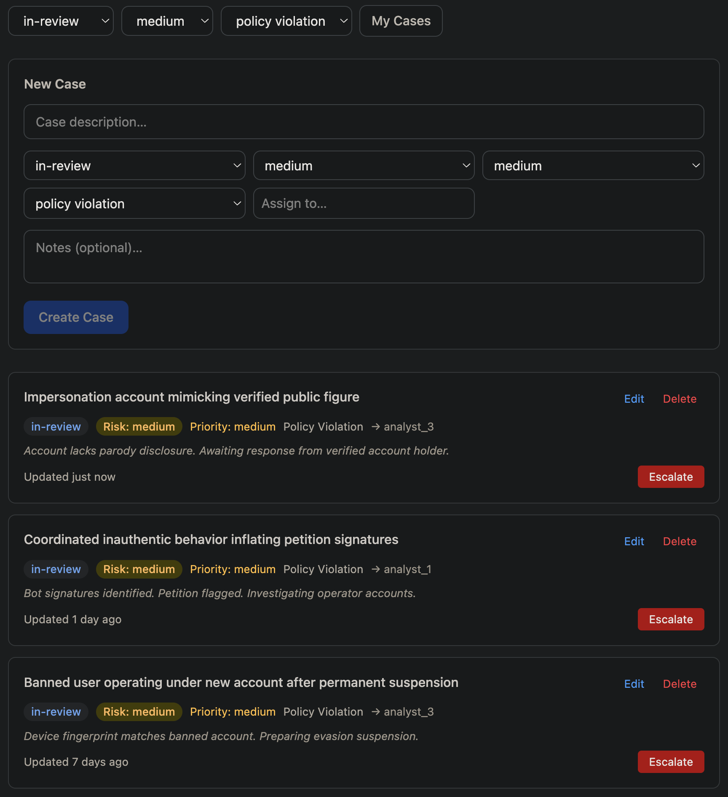
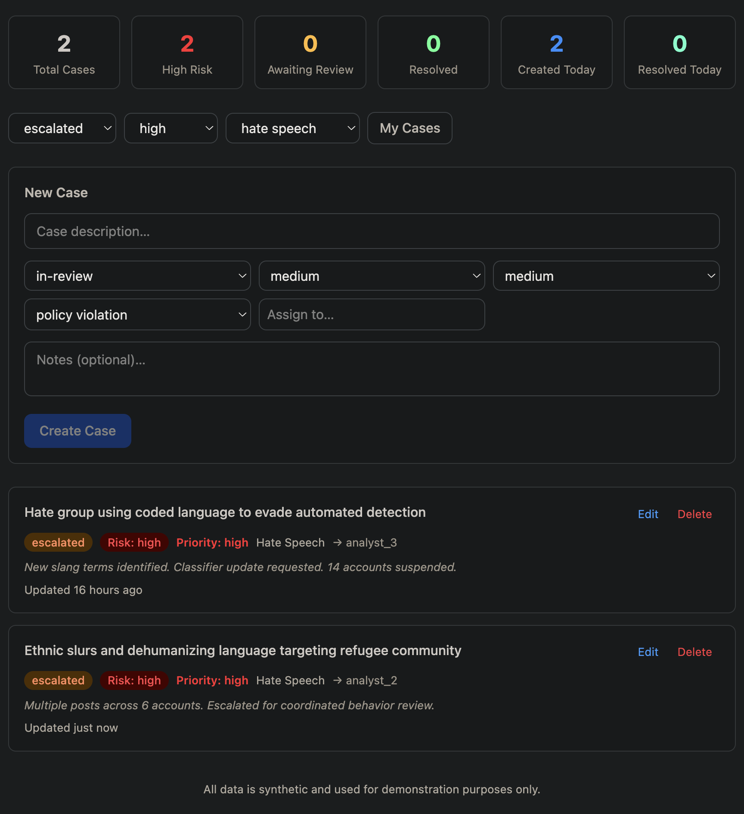
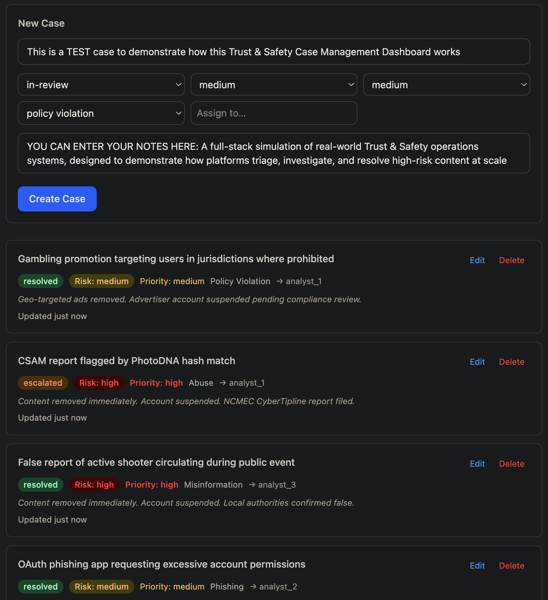

---

# 🛡️ Trust & Safety Case Management Dashboard

A full-stack simulation of real-world **Trust & Safety operations systems**, designed to demonstrate how online platforms detect, triage, investigate, and resolve harmful content at scale.

> ⚠️ **Disclaimer:** All cases, users, and content in this application are fictional and created strictly for portfolio demonstration purposes.

---

## 🎯 Why This Project Exists

Most CRUD applications demonstrate technical execution.

This project goes further by showcasing **domain understanding of Trust & Safety and Integrity operations**, including:

* Case triage and prioritization workflows
* Risk-based decision making (low / medium / high severity)
* Analyst assignment and ownership models
* Escalation pipelines for high-risk content
* Operational metrics and dashboarding

It reflects how real **Trust & Safety, Integrity, and Risk Operations teams** function at companies such as Meta, TikTok, and Google.

---

## 🧠 What This Simulates

* 📥 **Incoming case queues** (spam, fraud, abuse, misinformation, etc.)
* 🔍 **Analyst review workflows** (investigate, annotate, update status)
* 🚨 **Escalation systems** for high-risk content
* 📊 **Operational dashboards** with real-time metrics
* 👥 **Ownership model** (“assigned to me” filtering)

---

## 📸 Screenshots

### 🧭 Dashboard Overview



High-level view of case volume, risk distribution, and operational KPIs.

---

### 🚦 Case Management & Filtering



Filter cases by status, risk level, category, and analyst assignment.

---

### 🔴 Escalation Workflow



One-click escalation updates case priority and status in real time.

---

### 📝 Case Details & Notes



Analysts document investigation findings and decision context.

---

## ✨ Key Features

### 🚦 Case Lifecycle Management

Track cases through structured states:

`pending → in-review → escalated → resolved`

### 🔴 Risk-Based Prioritization

* Low / Medium / High risk classification
* High-risk cases surfaced in operational metrics

### ⚡ Escalation System

* One-click escalation workflow
* Automatically updates status and priority

### 📊 Operational Metrics

* Total cases
* High-risk cases
* Pending vs resolved
* Cases created today
* Cases resolved today

### 👤 Analyst Workflow Simulation

* “Assigned to me” filtering
* Ownership-based workload distribution

### 🎯 Advanced Filtering

Filter by:

* Status
* Risk level
* Category
* Assigned analyst

---

## 🛠️ Tech Stack

### Backend

* Node.js
* Express
* MongoDB (Mongoose)

### Frontend

* React 19
* Vite
* Tailwind CSS v4

### Architecture

* REST API (`/api/cases`)
* Separate frontend/backend services
* Environment-based deployment (Render + Vercel)

---

## ⚡ Quick Start

```bash
git clone https://github.com/PercyLanda/trust-safety-dashboard.git
cd trust-safety-dashboard
npm install
npm install --prefix backend
npm install --prefix frontend
npm run demo
```

### What this does:

* Seeds 75+ realistic Trust & Safety cases
* Starts backend on `http://localhost:3000`
* Starts frontend on `http://localhost:5173`

---

## 🧪 API Example

```http
GET /api/cases
```

### Response

```json
{
  "success": true,
  "data": [...]
}
```

---

## 🌍 Live Demo

* **Frontend:** [https://trust-safety-dashboard-2mcpnw9zp-percylandas-projects.vercel.app](https://trust-safety-dashboard-2mcpnw9zp-percylandas-projects.vercel.app)
* **Backend API:** [https://trust-safety-dashboard.onrender.com/api/cases](https://trust-safety-dashboard.onrender.com/api/cases)

---

## 🚀 Deployment

### Backend (Render)

* Root Directory: `backend`
* Start Command: `npm start`

Environment Variables:

* `MONGO_URI`
* `CLIENT_URL`

---

### Frontend (Vercel)

* Root Directory: `frontend`

Environment Variables:

* `VITE_API_URL`

---

## 📌 What Makes This Different

This is not just a CRUD app.

It demonstrates:

* Trust & Safety systems thinking
* Real-world moderation workflows
* Risk operations modeling
* Scalable backend + frontend architecture
* Production deployment (Render + Vercel)

---

## 📣 Roadmap / Next Improvements

* Authentication (analyst roles & permissions)
* Audit logs for case history
* Advanced analytics dashboard
* Real-time updates (WebSockets)
* Role-based access control (admin vs analyst)

---

## 👤 Author

**Percy Landa**
📍 San Francisco Bay Area

* GitHub: [https://github.com/PercyLanda](https://github.com/PercyLanda)
* LinkedIn: [https://www.linkedin.com/in/percylanda/](https://www.linkedin.com/in/percylanda/)

---
